# MS Computing: Graphics and Visualization Coursework

## Fall 2009
 * [Advanced Computer Graphics I (CS6610)](#cs6610---advanced-computer-graphics-i)
 * [Scientific Visualization (CS6630)](#cs6630---scientific-visualization)
 * [Digital Image Processing (CS6640)](#cs6640---digital-image-processing)

## Spring 2010
 * [Advanced Computer Graphics II - Ray Tracing (CS6620)](#cs6620---advanced-computer-graphics-ii---ray-tracing)

## Fall 2010
 * [Computer Aided Geometric Design (CS6670)](#cs6670---computer-aided-geometric-design)
 * Computer Architecture (CS6810)

## Spring 2011
 * High Performance Computing and Parallelization (CS6230)
 * Parallel Programming for GPUs (CS6963)

## Fall 2011
 * Human Computer Interaction (CS6540)

## Spring 2013
 * [Computational Topology (CS6170)](#cs6170---computational-topology)

---
## CS6610 - Advanced Computer Graphics I
**Prof. Chuck Hansen**

### Assignment 1 - Textures

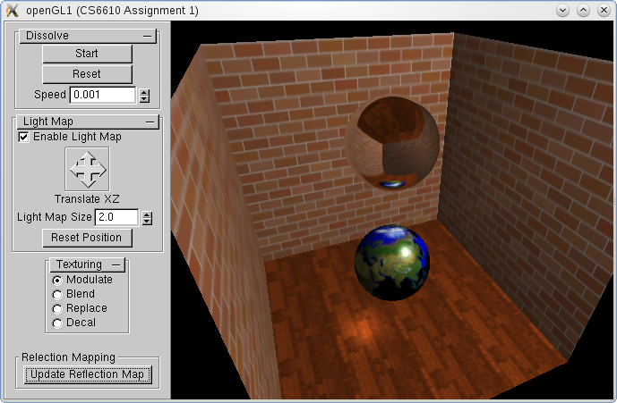

* Texture Maps
* Environment Mapping (cube mapping)
* Multi-textures
* Lightmaps

### Assignment 2 - Shadows

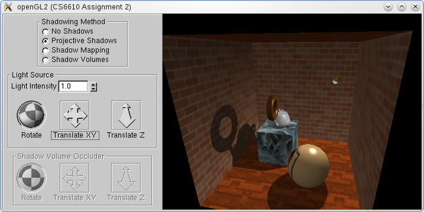
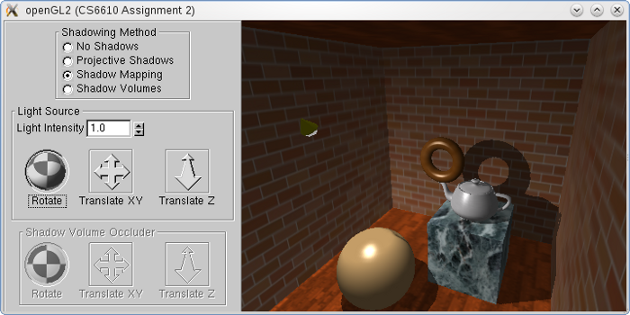
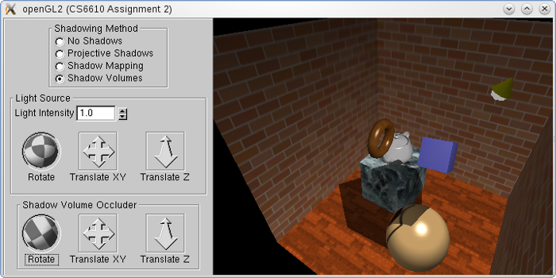

* Projected Shadows
* Shadow Mapping
* Shadow Volumes

### Assignment 3 - Shaders

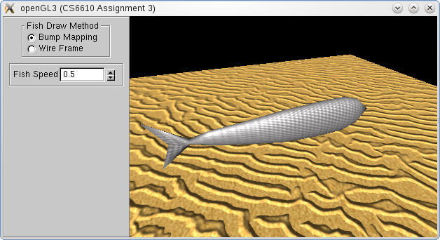

* Vertex Manipulations
* Per-Pixel Lighting
* Bump Mapping

### Project - Parallax Occlusion Mapping with Approximate Soft Shadows

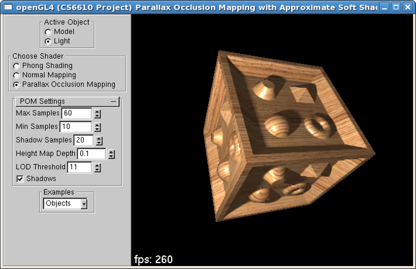

---
## CS6630 - Scientific Visualization
**Prof. Valerio Pascucci**

### Homework 1 - The Scientist and the Visualization Expert
This homework was designed to enable the students to appreciate the kind of collaboration and
teamwork that is required between the scientists - who are producing the data and wish to analyze
it and the visualization experts - who produce visualization of the data for the scientists to
analyze.

### Homework 2 - 2D Vector Fields

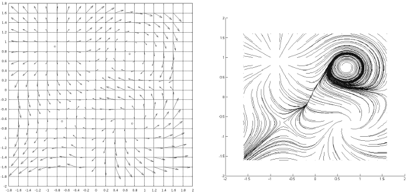

* 2D Vector Field Generation
* Linear and Bilinear Interpolation of 2D vector fields
* Critical Points Identification
  * Saddles
  * Repelling/Attracting Nodes
  * Repelling/Attracting Spirals
  * Centers
* Topology Plot

### Homework 3 - Isosurface computation for 3D scalar fields

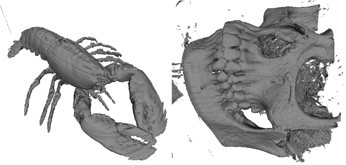

* Isosurface computation using Marching Tetrahedron algorithm
* Outputs the isosurfaces in .obj format

### Final Project - Fourier Volume Rendering

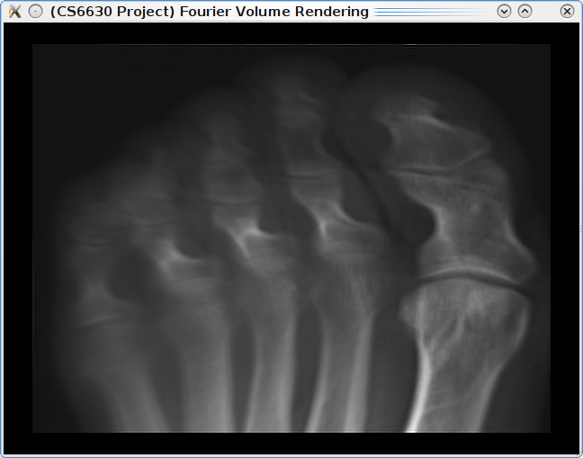
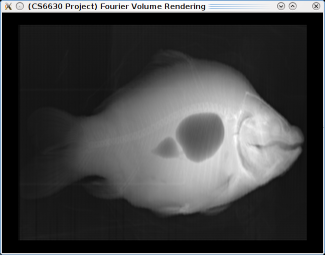

* Fourier Volume Rendering
* FFTW library for calculating Fourier Transforms

---
## CS6640 - Digital Image Processing
**Prof. Ross Whitaker**

### Project 1 - Image Processing Basics

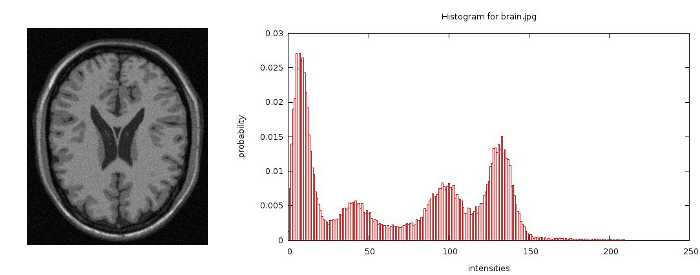
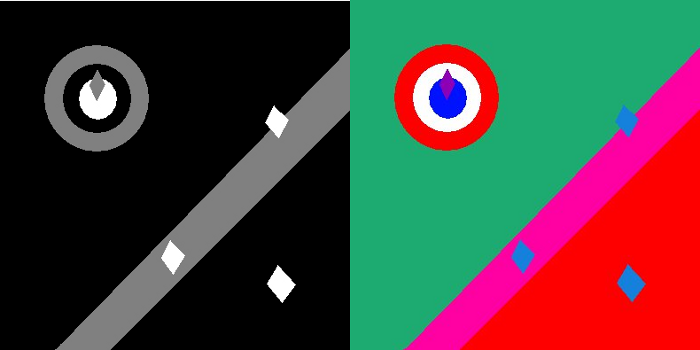
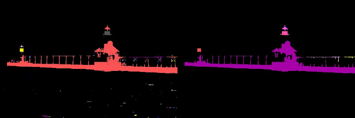

* Histograms
* Connected Components
* Topological Denoising

### Project 2 - Histogram Equalization

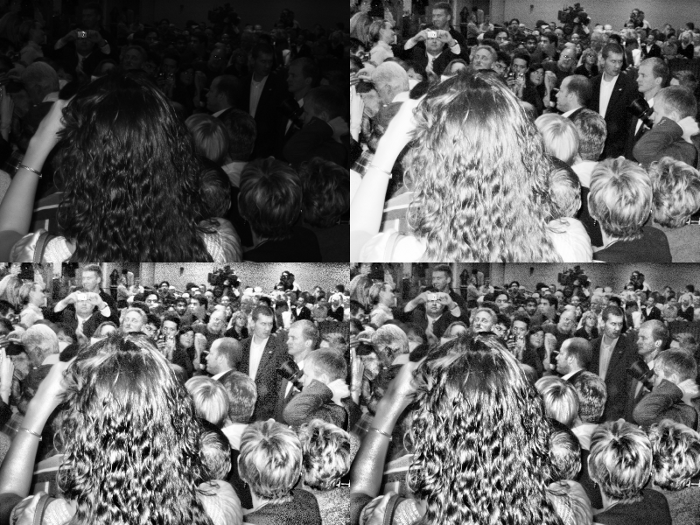

* Histogram Equalization
* Adaptive Histogram Equalization (AHE)
* AHE with Clipping

### Project 3 - Image Mosaicing

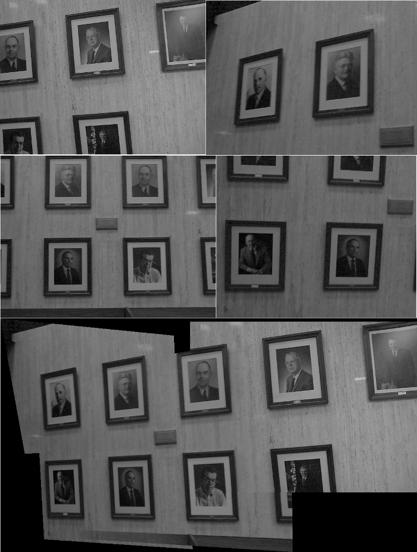

### Project 4 - Image Registration using Phase Correlation

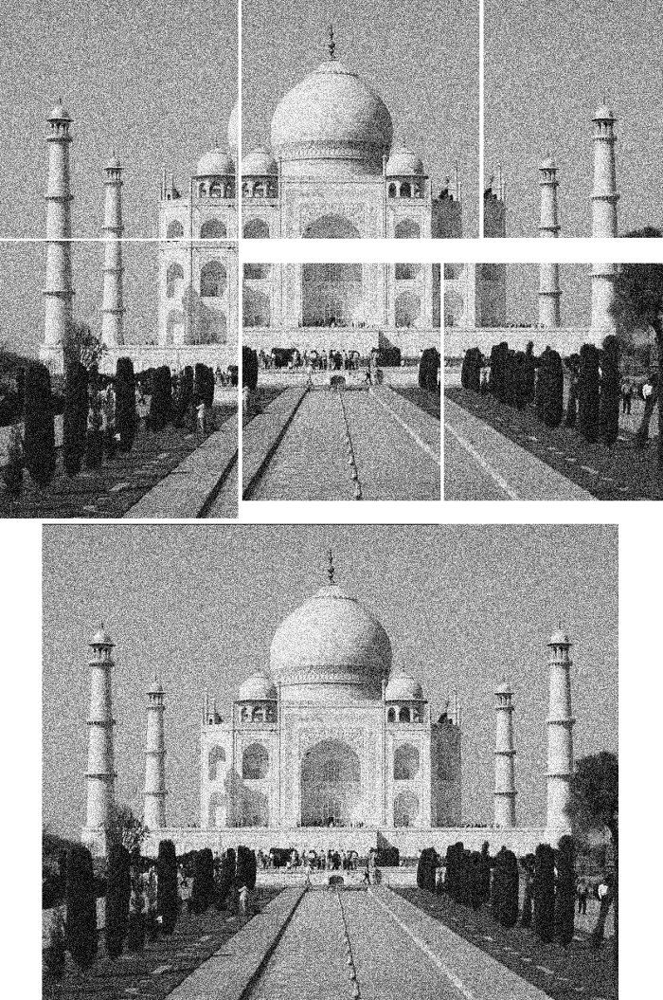

* Frequency Domain Phase Correlation
* Filtering in Frequency Domain

### Project 5 - Edge and Feature Detection

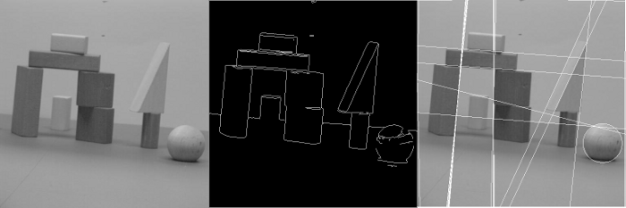

* Canny Edges
* Hough Transform
* Gaussian and Bilateral Filtering

---
## CS6620 - Advanced Computer Graphics II - Ray Tracing
**Dr. Peter Shirley**
**Dr. Steven Parker**

### Project 1 - Ray Tracing Basics

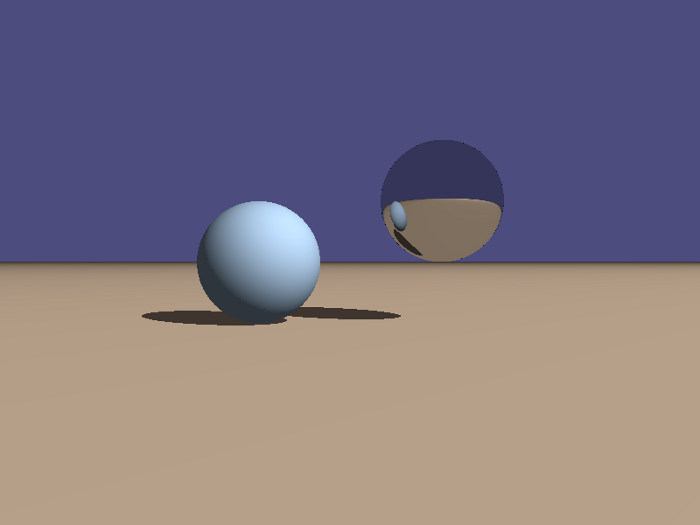

* Basics of Ray-Tracing and NVidia Optix.
* Intersection Shaders for Infinite Plane and Sphere
* Material Shaders for Lambertian and Perfect Specular materials

### Project 2 - Advanced Materials

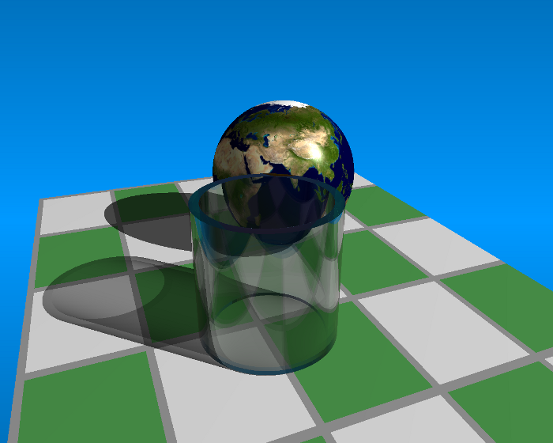

* Gradient Background
* Intersection Shader for complex object - Tube
* Image based and Procedural Textures
* Glass Material
* Refraction/Reflection of light
* Fresnel Effect (using Schlick's Approximation)
* Beer Effect

### Project 3 - Distributed Ray Tracing

* Antialiasing using Stochastic Sampling
* Focus Blur
* Motion Blur
* Soft Shadows
* Glossy Reflection
* Frosted Glass

### Project 4 - Hybrid Rendering

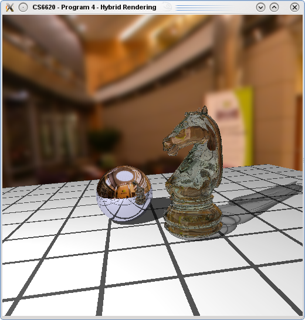

* Two Pass Rendering
* First Pass computes visibility information using GLSL
* Second pass performs shading using Ray Tracing (Optix)

### Final Project - Monte Carlo Path Tracer

* Monte Carlo Path Tracer
* Uses Stochastic Sampling and Triangular Filter for Antialiasing
* Implements Ashikhmin-Shirley BRDF model
* Procedurally generated ball texture.
* Procedurally generated wood texture using Perlin Noise.
* Brushed Metal material on lamp using Anisotropic BRDF.

---
## CS6670 - Computer Aided Geometric Design
**Prof. Elaine Cohen**

### Assignment 1 - Bezier Curves

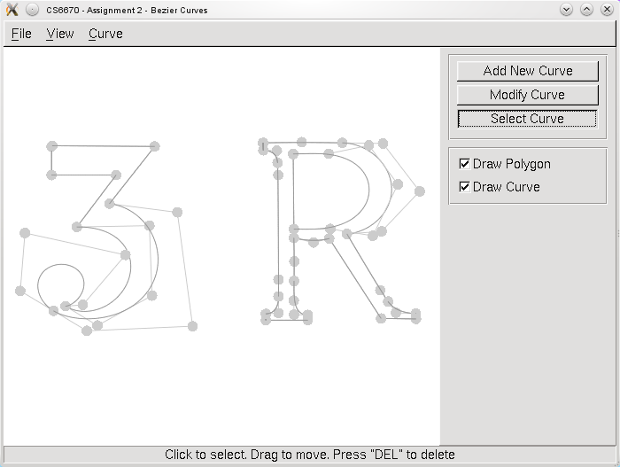

### Assignment 2 - B-Spline Curves

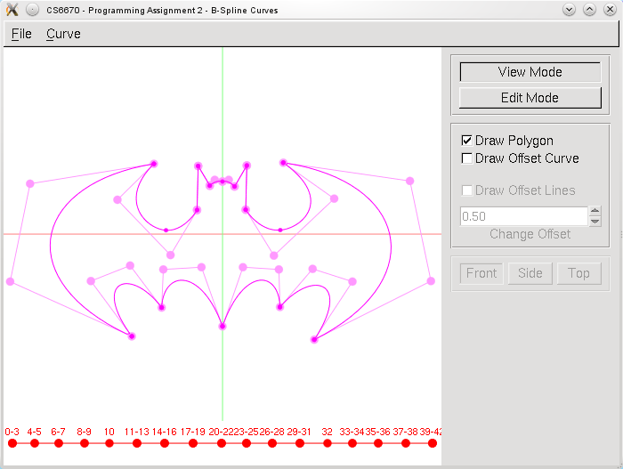
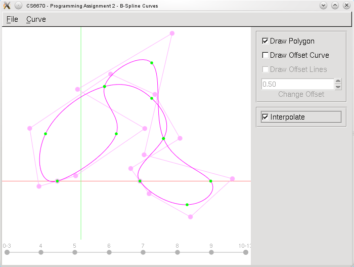

### Assignment 3 - B-Spline Surfaces

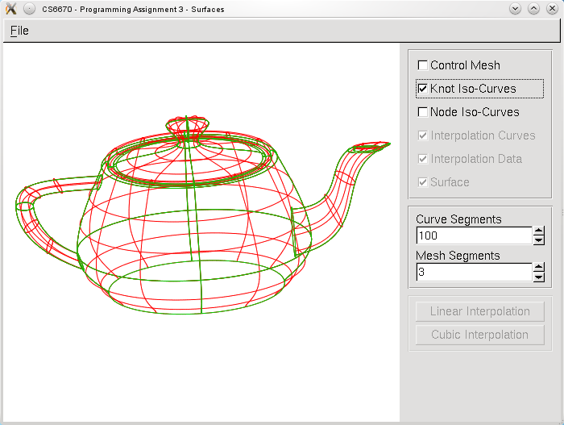
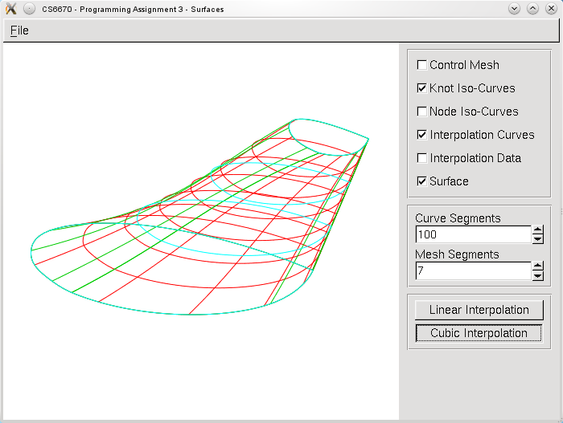

---
## CS6170 - Computational Topology
**Prof. Valerio Pascucci**

### Project - Topology Matching

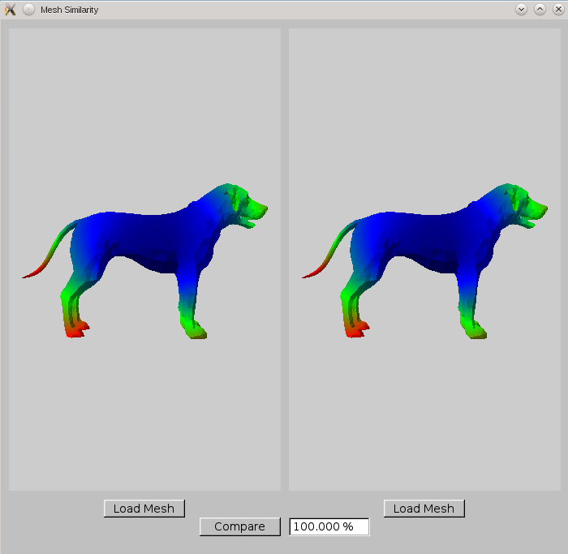
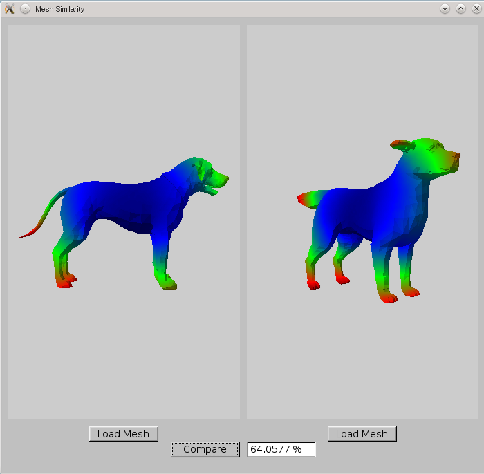
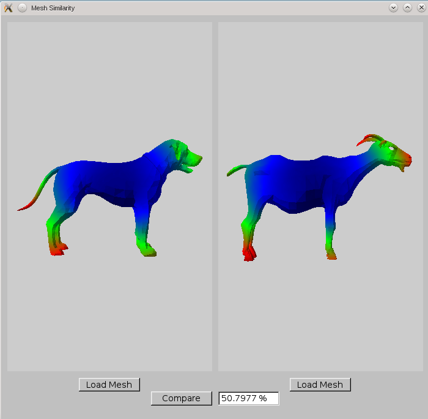
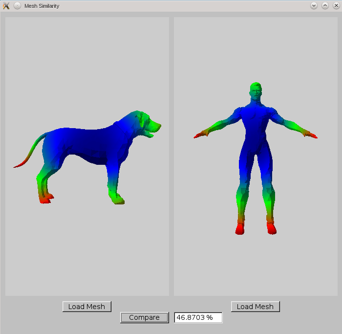

Implementation of the paper: Topology Matching for Fully Automatic Similarity
Estimation of 3D shapes. By Masaki Hilaga, Yoshihisa Shinagawa, Taku Kohmura,
and Tosiyasu L. Kunii. In Proceedings of the 28th Annual Conference on Computer
Graphics and Interactive Techniques, pp 203-212
